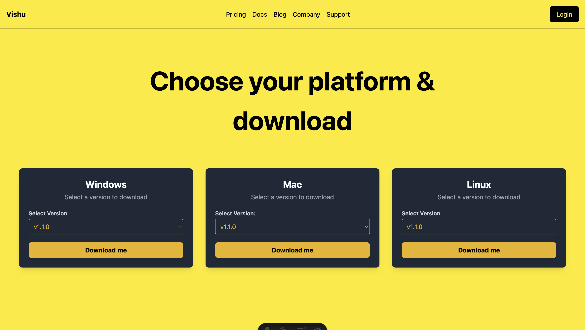

yellow colour hex - [#ffe900]

starting with db tables

SQL Schema (Table Structure)
Run this SQL command in your PostgreSQL (Neon DB):

CREATE TABLE releases (
    id SERIAL PRIMARY KEY,
    platform_type VARCHAR(10) CHECK (platform_type IN ('Windows', 'Mac', 'Linux')),
    version VARCHAR(10) NOT NULL,
    metadata TEXT,
    release_date DATE DEFAULT CURRENT_DATE,
    download_url TEXT NOT NULL
);

Example Data for Testing

INSERT INTO releases (platform_type, version, metadata, download_url)
VALUES 
-- Windows Releases
('Windows', 'v1.1.0', 'Initial Windows release', 'https://example.com/download/windows-v1.1.0.exe'),
('Windows', 'v1.2.0', 'Performance improvements', 'https://example.com/download/windows-v1.2.0.exe'),
('Windows', 'v1.3.0', 'Security fixes', 'https://example.com/download/windows-v1.3.0.exe'),

-- Mac Releases
('Mac', 'v1.1.0', 'Initial Mac release', 'https://example.com/download/mac-v1.1.0.dmg'),
('Mac', 'v1.2.0', 'Bug fixes and updates', 'https://example.com/download/mac-v1.2.0.dmg'),
('Mac', 'v1.3.0', 'Performance improvements', 'https://example.com/download/mac-v1.3.0.dmg'),

-- Linux Releases
('Linux', 'v1.1.0', 'First Linux version', 'https://example.com/download/linux-v1.1.0.tar.gz'),
('Linux', 'v1.2.0', 'Optimized for stability', 'https://example.com/download/linux-v1.2.0.tar.gz'),
('Linux', 'v1.3.0', 'Security patch update', 'https://example.com/download/linux-v1.3.0.tar.gz');
